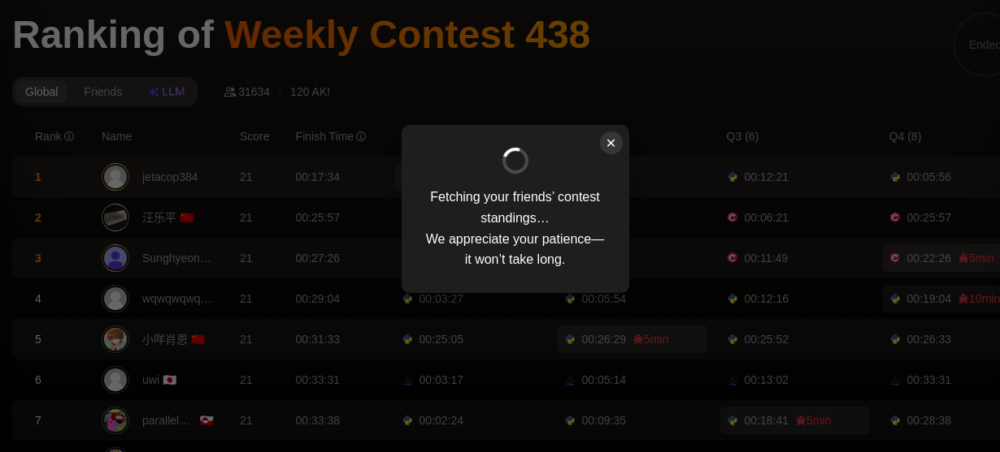
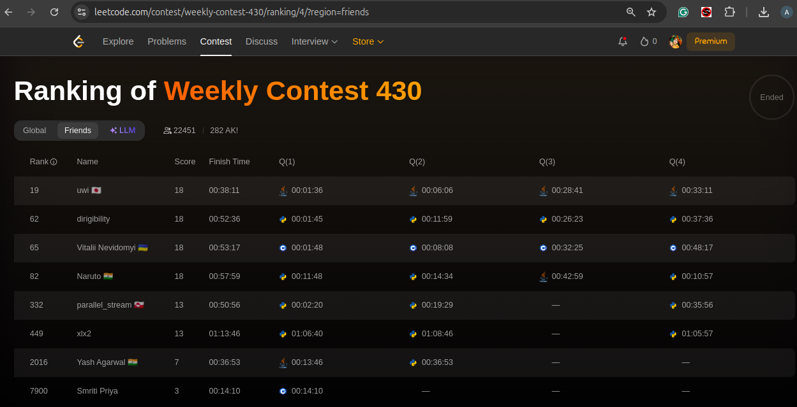
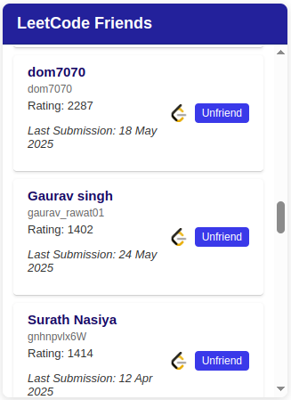

# LeetCode Friends Contest Tracker Extension

A Chrome extension that enhances the LeetCode contest ranking page by allowing you to follow your friends and view their contest performance alongside the global rankings.

## Features

* ⭐ **Add Friends**: Click the star icon next to the username of the user's LeetCode profile page.
* 📊 **Friends Tab**: A dedicated "Friends" button on the contest ranking page to toggle and display only your followed friends' performance.
* 💬 **Fetching Modal**: If no friend rankings are cached yet, clicking **Friends** displays a modal prompting the user to wait a few seconds while data loads.
* ⚡ **Fast Data Fetch**: Concurrently retrieves up to 12,500 rankings (first 500 pages) in \~100 seconds using batched asynchronous requests.
* 💾 **Local Storage**: Caches contest rankings and friend lists in Chrome's local storage for instant reloads.
* 🌐 **Country Flags**: Displays country emojis next to your friends' usernames for easy identification.
* ⏱️ **Detailed Metrics**: Shows username, rank, total score, finish time (with penalties), and per-problem submission times.
* 📢 **Popup Dashboard**: A browser action (popup) listing all your saved friends with their current contest rating and last submission date, linking directly to their LeetCode profiles.

## UI Preview

| Fetching Modal                                      | Friends Tab                                      | Popup Dashboard                     |
| --------------------------------------------------- | ------------------------------------------------ | ----------------------------------- |
|  |  |  |

## Installation

### 1. **From the Chrome Web Store**

Install the latest release directly:  
[LeetCode Friends Rank Checker – Chrome Web Store](https://chromewebstore.google.com/detail/LeetCode%20Friends%20Rank%20Checker/aajplhnjobdefcjgghdpanciaiioihhm)

- Click **Add to Chrome**.  
- Confirm by clicking **Add extension** in the popup.  
- Pin the extension to your toolbar for easy access.

---

### 2. **(Optional) From Source**

If you want to run a development build locally:

```bash
git clone https://github.com/JaishreeramCoder/leetcode-friends-contest-tracker.git
```

- Open Chrome and go to `chrome://extensions`.
- Enable **Developer mode** (top-right).
- Click **Load unpacked** and select the `leetcode-friends-extension` folder.
- Pin the extension to your toolbar.

## Usage

1. **Add a friend**:

   * Go to any LeetCode user's profile page (e.g., `https://leetcode.com/u/non_deterministic/`).
   * Click the ⭐ icon next to a username to follow.
2. **View friends in contest**:

   * Go to any LeetCode contest ranking page (e.g., `https://leetcode.com/contest/biweekly-contest-156/ranking/1/?region=global_v2`), find the new **Friends** button between the Global and LLM buttons.
   * Click **Friends**:

     * If data is already cached, it filters and displays only your followed users.
     * If not, a modal appears asking you to wait while it fetches results.
3. **Browser popup**:

   * Click the extension icon to open the popup.
   * See your saved friends along with:

     * Username (clickable link to profile)
     * User slug
     * Current contest rating
     * Date of last submission

## Architecture & Implementation

### 1. Data Extraction

* **Global Rankings API**: Leverages `https://leetcode.com/contest/api/ranking/{contestKey}/?pagination={page}&region=global_v2` to fetch 25 users per page without authentication.
* **Concurrency**: Uses a `poolLimit` (default 6) and `batchSize` (default 250), with a `BATCH_DELAY_MS` gap (default 6000ms) between batches, to fetch 500 pages in parallel batches.
* **Retry Logic**: On fetch failure, retries the same page after 1 second to ensure complete results.

### 2. Content Script (content.js)

* **Friend Star Injection**:

  * Uses a custom `waitForXPath()` helper to locate LeetCode's dynamically rendered span elements (text = "Rank").
  * Injects a star icon element; on click, stores friend data (`username`, `user_slug`) in Chrome local storage.
* **Rendering Friends Tab**:

  * Listens for URLs matching `/contest/api/ranking/{contestKey}/...`.
  * Reads cached rankings and friend list from local storage.
  * Converts UNIX timestamps to IST finish times and calculates `hh:mm:ss` durations.
  * Maps country names (e.g., "United States") to flag emojis via a predefined lookup.
  * Builds a table mirroring LeetCode's style (alternating row colors) and appends under the Friends tab.
* **Fetching Modal**:

  * If no cache exists, renders a modal overlay informing the user that results are being fetched.
  * Dismisses automatically once initial data batch completes.
* **Tab Toggle Logic**:

  * Hides Global and LLM sections when Friends is active, updating `data-state`, `aria-state`, and `tabIndex` for proper keyboard accessibility.

### 3. Background Script & Proxies

* (Future) Implementation may include advanced rate-limit handling via exponential backoff and proxy rotation in `background.js`.

### 4. Popup (popup.html, popup.js, popup.css)

* **No Friends**: Displays a placeholder message if no saved friends.
* **Friend List**:

  * Dynamically fetches each friend's current rating and last submission date using LeetCode's GraphQL endpoint (`https://leetcode.com/graphql`).
  * Renders a clickable list; selecting a friend opens their LeetCode profile.
* **Styling**: Clean, minimal CSS in `popup.css` with responsive layout.

## Configuration

Adjust the following constants in `content.js` to tune performance:

```js
const POOL_LIMIT = 6;
const BATCH_SIZE = 250;
const BATCH_DELAY_MS = 6000;
const MAX_PAGES = 500; // fetches up to 12,500 users
```

## Resources

* 📹 **Demo Video**: [Watch on YouTube](https://youtu.be/wUPa8KRKiaY?si=Jw9PafIj-Qd4HQZD)
* 📄 **Development Flow Document**: [Read the flow details](https://docs.google.com/document/d/1JiM4skOP-ovE9L6edUGRO_fWKWqp2wixcn3hw18gxWU/edit?tab=t.0)

## Contributing

Contributions are welcome! Feel free to submit issues or pull requests for bug fixes, feature suggestions, or performance improvements.

## License

This project is licensed under the MIT License. See [LICENSE](LICENSE) for details.
